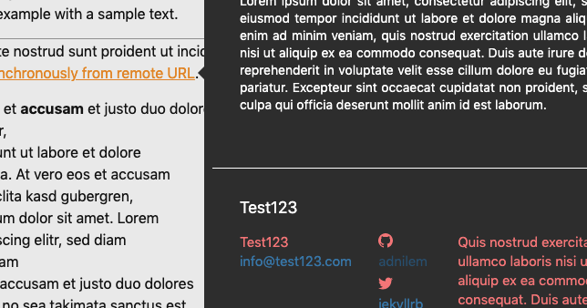

Embeding inline images in the text seems difficult to do directly in the xml file. 
Here are some possible workaround.

### Using the [binaryObject](https://tei-c.org/release/doc/tei-p5-doc/en/html/ref-binaryObject.html) element
"`<binaryObject>` provides encoded binary data representing an inline graphic, audio, video or other object."  
This method would not be practical, especially when there are multiple music images per page. 
Also, I could'nt get the image to display correctly after it is encoded to Base64 and inside the `<binaryObject>` element. 

### graphic, figure and media elements
Tei-c.org also presents those 3 elements to anchor media to particular point in the text but when an image is embeded in the XML file this way, Tei Publisher doesn't display it at all. 

### Alternate mode / popover
One way to show images could be throught Tei Publisher's alternate mode, a popover that appears when hovering over or clicking on certain parts of the text. 
Here is an example with a sample text. 

<html>
    <head>
        <meta charset="UTF-8">
        <meta name="viewport" content="width=device-width, initial-scale=1.0">
        <meta http-equiv="X-UA-Compatible" content="ie=edge">
        <title>TEI Publisher Webcomponents Example</title>
        
        
        
           
    </head>
    <body>
    		<pb-page endpoint="https://teipublisher.com/exist/apps/tei-publisher">
		    <main>  
		        
Qui veniam ipsum officia consequat aute nostrud sunt proident ut incididunt amet 
		            popover that load popover content asynchronously from remote URL.

		        
Lorem ipsum dolor sit amet
		            At vero eos et <strong>accusam</strong> et justo duo dolores  
		            et ea rebum, consetetur sadipscing elitr, 
		            sed diam nonumy eirmod tempor invidunt ut labore et dolore 
		            magna aliquyam erat, sed diam voluptua. At vero eos et accusam  
		            et justo duo dolores et ea <pb-popover theme="light">rebum<template slot="alternate">A standard text popup.</template></pb-popover>. Stet clita kasd gubergren,  
		            no sea takimata sanctus est Lorem ipsum dolor sit amet. Lorem 
		            ipsum dolor sit amet, consetetur sadipscing elitr, sed diam 
		            nonumy eirmod et dolore magna aliquyam  
		            erat, sed diam voluptua. At vero eos et accusam et justo duo dolores 
		            et ea rebum. Stet clita kasd gubergren, no sea takimata sanctus est 
		            Lorem ipsum dolor sit amet.

		        
Another way to do it would be
		            <pb-popover remote="http://127.0.0.1:4000/ddd/img/riemann-sample-music.jpg" persistant="">URL to imageLoading ...</pb-popover>.

		        <pb-popover for="dolore" remote="http://127.0.0.1:4000/ddd/">Loading...</pb-popover>
		    </main>
		</pb-page>  
    </body>
</html>

The first popover loads content from another URL and displays another web page in the popover:

Two problems:
- the whole page gets "shaky" when hovering over the trigger words
- it displays the whole page, which is distracting when we only need an image

The "URL to image" popover uses an image url (local atm) to be displayed in the popover:

This option simply doesn't work. 
